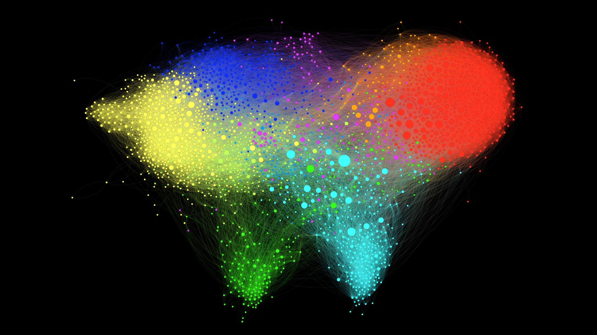

# twitter-graph

I spend a lot of time on Twitter, and over the years I have been following a wide variety of people: old friends, work colleagues, funny accounts, etc.
Gradually, my timeline has become this messy mix that makes Twitter so enjoyable. 

Wouldn't it be be nice, though, to have some hindsight and perspective on what's actually going on?

Contents | [Example](#behold-the-graph-of-my-twitter-friends) | [Usage](#usage) | [References](#references) | [Credits](#credits)

## Behold: the graph of my Twitter friends



<p align="center">
<em>My twitter world litterally looks like a world map, which is fantastic!</em>
</p>

#### Download

| Original | [1080p](examples/friends/friends_1080p.png) | [2160p](examples/friends/friends_2160p.png) | [4320p](examples/friends/friends_4320p.jpg) | [8640p](examples/friends/friends_8640p.jpg) |  [pdf](examples/friends/friends.pdf) |
| ---- |:-----:|:-----:|:-----:|:-----:|:-----:|  
| Labeled | [1080p](examples/friends/friends_label_1080p.png) | [2160p](examples/friends/friends_label_2160p.png) | [4320p](examples/friends/friends_label_4320p.jpg) | [8640p](examples/friends/friends_label_8640p.jpg) | [pdf](examples/friends/friends_label.pdf) |
| Hubs | [1080p](examples/friends/friends_hubs_1080p.png) | [2160p](examples/friends/friends_hubs_2160p.png) | [4320p](examples/friends/friends_hubs_4320p.jpg) | [8640p](examples/friends/friends_hubs_8640p.jpg) | [pdf](examples/friends/friends_hubs.pdf) | 

#### Clusters

By running a clustering algorithm [1, 2], several communities are automatically discovered: 
*  the Machine Learning research community;
*  French academia;
*  software engineers, mainly from my internship at Twitter, and silicon valley startups;
*  the Drone community, from my time at Parrot;
*  entertainment accounts: youtubers, cartoonists, video games.

As we zoom in closer, we can find additional smaller clusters:
*  the SequeL lab, where I am doing my PhD, and French researchers in theoretical ML
*  Anglo-Saxon academia;
*  students and staff of Mines ParisTech, my university;
*  French tech, startups and entrepreneurs

#### Popular accounts

The size of the nodes represents which accounts are the most popular *according to this graph*.  
 
Intuitively, a *popular* account is followed by many other *popular* accounts. Popularity is also related the probability of reaching a node by walking randomly in the graph. The PageRank algorithm [3], used in search engines, provides such a metric. 

<p align="center">
  <a href="https://github.com/eleurent/twitter-graph/blob/master/examples/friends/friends_label_8640p.jpg"></a>
</p>

On this graph the results are reasonable: accounts with many followers such as [@elonmusk](https://twitter.com/elonmusk), [@ylecun](https://twitter.com/ylecun) and [@snowden](https://twitter.com/snowden) end up with a high PageRank. But the structure of the network also plays an important part, since by only relying on the number of followers, accounts such as [@TheRealJimCarey](https://twitter.com/TheRealJimCarey), [@RobertDowneyJr](https://twitter.com/RobertDowneyJr), [@tomhanks](https://twitter.com/tomhanks) would be very salient while they barely stand out in terms of PageRank.

#### Hubs

Instead of scaling the nodes by popularity, we can also look for nodes that are in-between several communities, and connect them together. It is measured by the Betweenness Centrality, which measures how often a node appears on shortest paths between nodes of the Network.
 
<p align="center">
  <a href="https://github.com/eleurent/twitter-graph/blob/master/examples/friends/friends_hubs_8640p.jpg"></a>
</p>

For instance, we see accounts that belong to both the AI/ML research and French academia stand out, like [@freakonometrics](https://twitter.com/freakonometrics) and [@bguedj](https://twitter.com/bguedj), or people like [@chr1sa](https://twitter.com/chr1sa) who is in-between drones and Silicon Valley clusters. 

#### Statistics

| Statistics | Value | 
| ------------- |:-------------:| 
| Nodes | 2406 |
| Edges | 107697 |
| Diameter | 9 |
| Average path length | 3.1 |
| Average degree | 44.65 |
| Average clustering coefficient| 0.234 |  

### The graph of my followers


The first thing we can notice is that this graph looks more clustered than the previous one, which is confirmed by a higher average clustering coefficient.
Some clusters also seem to have disappeared, namely the  entertainment and  Anglo-Saxon academia.     

#### Downloads

| Original | [1080p](examples/followers/followers_1080p.png) | [2160p](examples/followers/followers_2160p.png) | [4320p](examples/followers/followers_4320p.jpg) | [8640p](examples/followers/followers_8640p.jpg) |  [pdf](examples/followers/followers.pdf) |  [svg](examples/followers/followers.svg) |
| ---- |:-----:|:-----:|:-----:|:-----:|:-----:|:-----:|
| Labeled | [1080p](examples/followers/followers_label_1080p.png) | [2160p](examples/followers/followers_label_2160p.png) | [4320p](examples/followers/followers_label_4320p.jpg) | [8640p](examples/followers/followers_label_8640p.jpg) | [pdf](examples/followers/followers_label.pdf) | [svg](examples/followers/followers_label.svg) |
| Hubs | [1080p](examples/followers/followers_hubs_1080p.png) | [2160p](examples/followers/followers_hubs_2160p.png) | [4320p](examples/followers/followers_hubs_4320p.jpg) | [8640p](examples/followers/followers_hubs_8640p.jpg) | [pdf](examples/followers/followers_hubs.pdf) | [svg](examples/followers/followers_hubs.svg) |  


#### Statistics

| Statistics | Value | 
| ------------- |:-------------:| 
| Nodes | 839 |
| Edges | 10614 |
| Diameter | 8 |
| Average path length | 3.4 |
| Average degree | 12.65 |
| Average clustering coefficient| 0.316 |  


## Usage

### Step 1. Get the data

To get access to the Twitter API, you must first register on the [Twitter Developer Portal](https://developer.twitter.com/en/apps). Then, create an app (with read permissions) and record your authentication keys in `credentials.json`.

**NEW!** You can now declare several standalone apps on the Twitter Developer Portal (up to 10) and save all the corresponding keys in `credentials.json`. These keys will be used to send the API calls in parallel, thus yielding a **x10 speedup**.

Then, install requirements with
```pip3 install -r requirements.txt```

and finally run the script `fetch_data.py`.

```
fetch_data.py (user|tweets) <query> [options]

Fetch a list of users from Twitter API.
- In the user mode, <query> refers to a username, and we get their friends and followers.
- In the tweets mode, <query> refers to a search query, and we get the users of the resulting tweets.

Options:
  -h --help                   Show this screen.
  --max-tweets-count <type>   Maximum number of tweets to fetch before stopping. [default: 2500].
  --graph-nodes <type>        Nodes to consider in the graph: friends, followers or all. [default: followers].
  --edges-ratio <ratio>       Ratio of edges to export in the graph (chosen randomly among non-mutuals). [default: 1].
  --credentials <file>        Path of the credentials for Twitter API [default: credentials.json].
  --excluded <file>           Path of the list of excluded users [default: excluded.json].
  --out <path>                Directory of output files [default: out].
  --stop-on-rate-limit        Stop fetching data and export the graph when reaching the rate limit of Twitter API.
  --run-http-server           Run an HTTP server to visualize the graph in you browser with d3.js.
```

In the `user` mode, you can enter a username and the script will start by getting the list of their friends and followers, before going through these accounts one by one in order to build the edges of the graph.

```console
$ python3 fetch_data.py user eleurent
Found 841 followers.
Found 2406 friends.
[1/2406] Fetching friends of @Mehdi_Moussaid
[2/2406] Fetching friends of @Inria_Lille
[3/2406] Fetching friends of @Limericking
```

Alternatively, in the `tweets` mode, you can enter a search query, and the script will the corresponding tweets and their authors.

Note that Twitter monetizes historical search results through Gnip, and that you will only be able to access the previous seven days worth of tweets through that endpoint.

```console
$ python3 fetch_data.py tweets #AcademicChatter --max-tweets-count=200
Found 100/200 tweets.
Found 200/200 tweets.
[1/200] Fetching friends of @Dr_Meming
[2/200] Fetching friends of @EtheHerring
[3/200] Fetching friends of @GrumpyReviewer2
```

Since Twitter limits the rate of its API to 15 requests per window of 15 minutes, this is going to take a while.
In order to interrupt and resume the requests at any time, a very simple caching system immediately exports the requests results to a local json file.

```
KeyboardInterrupt

python3 fetch_data.py
[1/2406] @Mehdi_Moussaid found in cache.
[2/2406] @Inria_Lille found in cache.
[3/2406] @Limericking found in cache.
[4/2406] Fetching friends of @Ariane_lis
```

If you are too impatient and want to preview the graph with the data downloaded so far, use the `--stop-on-rate-limit` option.

The resulting graph will be exported to two .csv files containing the nodes and edges.
```
[4/2406] Fetching friends of @Ariane_lis
...but it failed. Error: [{'message': 'Rate limit exceeded', 'code': 88}]
You reached the rate limit. Disable --stop-on-rate-limit or try again later.
Successfully exported 2406 nodes to out\graph.nodes.csv.
Successfully exported 128 edges to out\graph.edges.csv.
```

Finally, note that you can skip an account by filling out the `exclude.json` file.

### Step 2. (optional) Visualize with [d3.js](https://d3js.org/)


Once exported, the graph can be visualized directly in your browser with [d3-force](https://github.com/d3/d3-force).

To that end, use the ``--run-http-server`` to automatically spawn an HTTP server at the end of the script.
```
[2406/2406] Fetching friends of @AdrienRahier
Successfully exported 2406 nodes to out\graph.nodes.csv.
Successfully exported 107697 edges to out\graph.edges.csv.
Serving HTTP at http://localhost:8000?nodes=out/graph.nodes.csv&edges=out/graph.edges.csv
```

Open the URL in your browser to see the results. While [d3-force](https://github.com/d3/d3-force) is lightweight and convenient, it can be a bit slow when the graph becomes too large (about 2000 nodes on my computer), and will only handle the graph layout.
For more advanced customization options, you can turn to Gephi. 

### Step 2. (bis) Visualize with [Gephi](https://gephi.org/)

 
> [Gephi](https://gephi.org/) is the leading visualization and exploration software for all kinds of graphs and networks. Gephi is open-source and free.
 
The [User Guide](https://gephi.org/users/) contains all the information that you need, and I recommend that you read the [Quick Start Guide](https://gephi.org/users/quick-start/).
I will simply recall the main steps involved. 

#### 1. Import nodes

* Start a new project;
* go to the the *Data Laboratory* tab;
* select *Import Spreadsheet* in the toolbar, and choose `out/graph.nodes.csv`;
* in the *General Options* pane, select _Import as: Nodes table_, then click Next and Finish;
* in the *Import report* window, select _Append to existing workspace_, and click OK.

A table of nodes should appear in the Data Laboratory.

#### 2. Import edges

* select again *Import Spreadsheet* in the toolbar, and choose `out/graph.edges.csv`;
* in the *General Options* pane, select _Import as: Edges table_ **(not Matrix)**, then click Next and Finish;
* in the *Import report* window, click on *More options* and uncheck *Create-missing nodes* and choose *Edges merge strategy: Last*; 
* select _Append to existing workspace_, and click OK.

A table of edges should appear in the Data Laboratory.

#### 3. Choose a layout

* Go back to the *Overview* tab. You should see the graph with a random square layout;
* In the *Layout* window, select a force-based layout, and click *Run*. I use ForceAtlas2 [4];
* You can tinker with the layout parameters, such as *strength*, *Dissuade Hubs* or *Prevent Overlap*.

The graph will reorganise so that connected nodes are closer, and you should see the emergence of clusters.
Once the graph has converged, stop the simulation.

#### 4. Set the nodes sizes

As mentioned above, I use PageRank [3] to set the nodes sizes.
* First, the PageRank of nodes must be computed. In the *Statistics* window, locate *Network Overview/PageRank* and click Run. Keep default parameters and close the report;
* In the *Appearance* window, select *Nodes* and *Size* in the toolbar. Then, select *Ranking*, *PageRank*. Select the range of sizes (I use 10-50), and click Apply.  

The nodes labels can be enabled by clicking the black `T` icon in the bottom *Overview* toolbar. Then, the labels can be scaled with node size  by selecting the `A` icon (Size mode) and choosing Node size.  

#### 4. Set the nodes colors

The nodes can be colored automatically in the Appearance/Nodes/Color tab, by either a Partition of attributes (e.g. verified or location), or by a Ranking of attributes (e.g.  Degree, In-Degree, Out-Degree, followers_count, etc.).

In order to identify clusters, we must first run the *Modularity* algorithm from the Statistics window. Use the *Resolution* parameter to tune the desired number of clusters.
Then, set the nodes colours in the Appearance window by Ranking of Modularity.

#### 5. Render

Go to the Preview window, select the desired options, and Export to png, pdf or svg.

#### 6. (optional) Exclude the very far nodes

In order to improve the final Render, it might be useful to exclude the very far nodes.
To do this, go to the Overview tab, click on *Filters* (right panel). Open *Topology* and double-click on *Giant Component*.
Just below, in the *Queries* panel, activate this filter by pressing the *Filter* button. You should now be able to see in the *Context* panel at the top the percentage of nodes visible.

#### 8. (optional) Make the graph dynamic, based on nodes timestamps

First, a date field must be parsed as a timestamp. In the Data Laboratory, click *Merge colums*, and select a colum such as `created_at` or `query_created_at`, and pick the *Create time interval* merge strategy.
Then, if you want the nodes to persist after appearing (rather than disappear) select a blank end-time column.
Choose the parse date option, and set the Date format to `EEE MMM dd HH:mm:ss Z yyyy`. After validating, an *Enable timeline* button should appear at the bottom of the window, which can be used to make a video of the graph evolution.

#### 7. (optional) Display Twitter Handles rather than names on the Graph

An easy solution for this is to go to the Data Laboratory tab. Click at the bottom on the *Copy data to other column* button. Select *screen_name* to *Label*. 
If you return now to the Overview tab you will see the Twitter's handle as labels.


## References
* [1] [Fast unfolding of communities in large networks](https://arxiv.org/abs/0803.0476), Blondel V. et al. (2008).
* [2] [Laplacian Dynamics and Multiscale Modular Structure in Networks](https://arxiv.org/abs/0812.1770), Lambiotte R. et al. (2008).
* [3] [Sergey Brin, Lawrence Page, The Anatomy of a Large-Scale Hypertextual Web Search Engine](https://snap.stanford.edu/class/cs224w-readings/Brin98Anatomy.pdf), Brin S., Page L. (1998).
* [4] [Continuous Graph Layout Algorithm for Handy Network Visualization Designed for the Gephi Software](https://journals.plos.org/plosone/article?id=10.1371/journal.pone.0098679), Jacomy M. et al. (2014).

## Credits

This project was more than inspired by this [excellent video](https://www.youtube.com/watch?v=UX7YQ6m2r_o) by [Mehdi Moussaïd
](https://twitter.com/Mehdi_Moussaid) [:tv:](https://www.youtube.com/fouloscopie).
